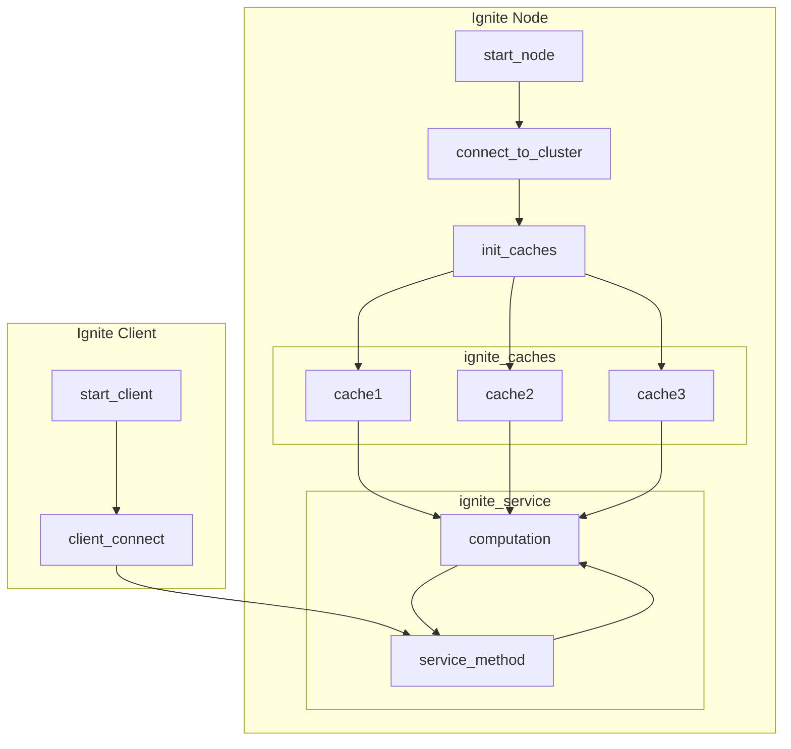

```mermaid
graph TD
    subgraph Ignite Node
        subgraph ignite_caches
            cache1
            cache2
            cache3
        end
        subgraph ignite_service
            service_method-->computation
            computation-->service_method
            cache1-->computation
            cache2-->computation
            cache3-->computation
        end
        start_node-->connect_to_cluster
        connect_to_cluster-->init_caches
        init_caches-->cache1
        init_caches-->cache2
        init_caches-->cache3

    end
    subgraph Ignite Client
        start_client-->client_connect
        client_connect-->service_method
    end
```    